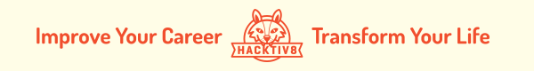

# Hacktiv8 Phase 0 Week 5: Recursive, Regex, and Object Oriented Programming in JavaScript

Selamat sudah melalui kegiatan pekan kelima! Setelah tiga minggu penuh bermain dengan console dan logika, minggu ini kita akan berlatih tentang konsep Rekursif, Regex, serta tipe data Object di JavaScript.

## Senin - Live Coding (Arrays, Looping, & Conditionals)

Tiba saatnya kita melakukan Live Coding yang bertujuan untuk menguji kemampuanmu sesuai dengan yang telah kamu pelajari dan kamu latih di pekan ini. Melalui live coding ini kami akan menilai pengertian kamu selama ini tentang JavaScript, dan tentunya kami akan memberikan feedback agar kamu bisa meningkatkan bagian mana yang masih kurang. Sesi live coding ini, tidak seperti tantangan-tantangan di hari-hari sebelumnya. **Kamu tidak bisa mengulang atau memperbaiki apa yang telah kamu kerjakan di sesi live coding.** Sesi live coding tidak dibuat untuk membuatmu gagal, namun untuk memastikan apakah kamu telah terlatih dengan soal-soal coderbyte sebelumnya. Gagal di sesi live coding tidak mutlak membuatmu gagal di Phase 0, namun akan mempengaruhi keputusan instruktur untuk bisa melanjutkanmu ke Phase 1.

## Selasa - Modularizing Code using Functions & Recursive Functions
- :notebook_with_decorative_cover:
[Mengenal Rekursif](/modules/js-function-recursive.md)
- :anchor: [[**Exercises 1**] Most Frequent Largest Numbers](modules/challenge-most-frequent-largest-numbers.md)
- :anchor: [[**Exercises 2**] Password Generator](modules/challenge-password-generator.md)
- :anchor: [[**Exercises 3**] Makan Terus Rekursif](/modules/challenge-makan-terus.md)
- :anchor: [[**Exercises 4**] Total Digit Rekursif](/modules/challenge-total-digit.md)
- :anchor: [[**Exercises 5**] Kali Terus Rekursif](/modules/challenge-kali-terus.md)

## Rabu - Git Branch
- :notebook_with_decorative_cover:
[Cara Submit menggunakan Git Branch (Untuk Exercises Hari Rabu)](/modules/submitting-on-a-new-branch.md)
- :anchor: [[**Exercises 6**] Damage Calculation](/modules/challenge-damage-calculation.md)
- :anchor: [[**Exercises 7**] Melee Ranged Grouping](/modules/challenge-melee-ranged-grouping.md)

## Kamis - Regex
- :notebook_with_decorative_cover:
[Mengenal Regular Expressions](/modules/regular-expressions.md)
- :anchor:
[[**Exercises 8**] Hapus Simbol](/modules/challenge-hapus-simbol.md)
- :anchor:
[[**Exercises 9**] Cari Pelaku](/modules/challenge-cari-pelaku.md)

## Jumat - Simulasi Final Live Code
Lakukan yang terbaik, mulailah beradaptasi dengan suasana live code agar lebih tenang. Usahakan kerjakan dengan hasil sendiri, masih ada kesempatan untuk tanya jawab di minggu berikutnya

## Sabtu dan Minggu

- [Refleksi kegiatan pekan ini](https://github.com/hacktiv8/phase-0-activities/blob/master/modules/reflection.md)
- [Blogging teknikal terkait skill pekan ini](https://github.com/hacktiv8/phase-0-activities/blob/master/modules/blog.md)

Selamat berpetualang dengan istilah dan teknologi yang makin seru! Jika ada hal yang perlu ditanyakan, langsung saja berdiskusi di grup ya.

Salam,

Tim Hacktiv8

