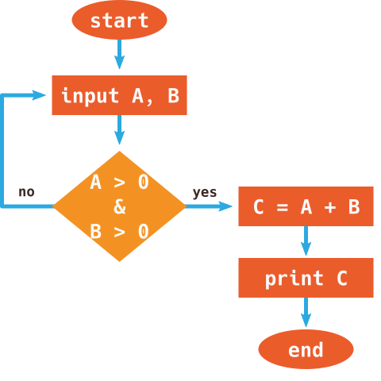
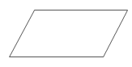
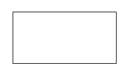
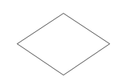

# Learn Algorithm and Pseudocode

## Objectives

- ▢ Memahami struktur alur program dengan algoritma dan pseudocode

## Learnings

### Mengenal Algoritma

Belajar pemrograman tentu saja memerlukan banyak berpikir secara logika, sehingga kita bisa memecahkan masalah atau melakukan kegiatan yang kita targetkan. Agar kita bisa menjelaskan alur logika kita, perlu digunakan algoritma.

Namun apa itu algoritma? Mari kita ilustrasikan terlebih dahulu.

Bagaimana cara kamu menggunakan komputer sehari-hari? Mulai dari menekan tombol on/off, menunggu proses booting, memasukkan password, membuka aplikasi yang dibutuhkan, kemudian bekerja sesuai aplikasi tersebut. Atau lain lagi, bagaimana cara menggunakan smartphone? Cukup unlock dari posisi standby, lalu pilih dan buka aplikasi yang dibutuhkan, dan seterusnya.

Nah itulah algoritma, kumpulan proses ataupun aturan untuk melakukan atau menyelesaikan sesuatu. Sesuatu ini biasanya berupa masalah atau kegiatan yang langkah-langkahnya pasti terbatas (tidak terus-menerus).

Dalam menggunakan bahasa pemrograman, kita bisa menggunakan atau bahkan tidak perlu menggunakan algoritma. Tapi hampir 99% pastinya perlu algoritma. Misalnya saja kita sudah tahu algoritma dasar dari perulangan dan perkondisian.

Algoritma bisa sesederhana kita jabarkan langkah-langkahnya seperti tadi, atau kita visualisasikan dalam bentuk flowchart seperti berikut.



- ▢ Tonton video ini jika perlu: [What is an algorithm and why should you care? - Intro to algorithms on Khan Academy](https://www.khanacademy.org/computing/computer-science/algorithms/intro-to-algorithms/v/what-are-algorithms)

### Basic Simbol / Notasi Flowchart

Flowchart merupakan diagram yang menggambarkan algoritma, atau proses-proses, yang digunakan untuk memecahkan suatu masalah. Intinya, flowchart bisa dipakai sebelum menulis kode karena syntax lebih mudah digambar. Syntax basic flowchart seperti berikut:

##### Start/End
<!-- Insert image of start/end symbol here -->


##### Input/Output
<!-- Insert parallelogram image here -->


##### Process
<!-- Insert rectangle image here -->


##### Conditional (IF)
<!-- Insert diamond image here -->


Banyak tools software yang dapat kamu gunakan untuk menggambar flowchart. salah satunya tools online editor [draw.io](https://www.draw.io/)

Bagi kalian yang nanti akan membuat sebuah sistem yang complex, menggambar flowchart bisa jadi hal pertama yang kalian lakukan sebelum coding. Kenapa ?

Karena untuk membuat sebuah sistem yang complex kalian harus punya gambaran yang jelas dari proses atau prosedur dari awal hingga ahkir sistem yang kalian buat. Kalau tidak ada flowchart kadang di tengah pengerjaan project kita lupa alur dari sistem yang kita buat. Tentu hal ini akan mempengaruhi codingan kalian.


### Mengenal Pseudocode

Atau agar lebih rapi, kita gunakan pseudocode. Psedudocode adalah konvensi terstruktur atau cara menyajikan penjelasan algoritma dengan bahasa yang deskriptif seperti kita menulis kalimat biasa sehingga mudah kita baca. Umumnya digunakan bahasa Inggris atau bahasa perantara yang mirip bahasa pemrograman. Lihatlah contoh algoritma penambahan angka sederhana dengan pseudocode berikut.

**Bahasa Inggris**

```
READ and SAVE "first number"
READ and SAVE "second number"
COMPUTE "first number" added by "second number"
SAVE previous computation result
SHOW the computation result
```

Bahasa inggris diatas nantinya akan diubah menjadi bahasa pemrograman yang kita mau. Dibawah ini adalah contoh hasil konversi pseudocode diatas menjadi kode di bahasa lain. Saat ini kamu hanya cukup melihat hasil konversinya sekilas saja, tidak harus dipelajari, karena kita akan fokus pada pseudocode terlebih dahulu.

**JavaScript**

```
var a,b,c;
a = prompt("First Number?");
b = prompt("Second Number?");
c = Number(a) + Number(b);
console.log(c);
alert("Result = " + c);
```

Dengan begini, kita bisa menjelaskan proses atau alur logika tanpa bahasa pemrograman tertentu. Sehingga juga logika yang sama bisa ditransfer atau diterapkan ke bahasa pemrograman lain. Misalnya...

**Python**

```
a = input("First Number? ")
b = input("Second Number? ")
c = int(a) + int(b)
print("Result", c)
```

**Ruby**

```
puts "First Number?"
a = gets.chomp
puts "Second Number?"
b = gets.chomp
c = a.to_i + b.to_i
puts c
```

### Lebih dalam tentang Pseudocode

Berikut adalah contoh yang perlu kamu tahu saat membuat pseudocode. **Jangan Terpaku 100% dengan contoh, karena dalam pseudocode tidak terpaku pada penggunakan kata tertentu. Selama pseudocode dapat dimengerti sesama pembaca, maka sudah cukup bisa digunakan.** Kita bisa menggunakan huruf kapital untuk keyword yang ditekankan dari sebuah step. Misal: CALCULATE 5 plus 2, atau DISPLAY "hello".

#### Storing Values

Biasanya, pada saat kita belajar matematika atau fisika, kita akan bertemu dengan rumus. Paling sederhana adalah rumus luas persegi, yaitu width dikalikan height.

Kita sebagai manusia dengan natural dapat langsung mengkalkulasi nilai panjang dan lebar untuk mendapatkan luas. Tapi, komputer tidak semudah itu. Komputer harus menyimpan nilai panjang dan nilai lebar di dalam memori. Memori komputer, bayangkan saja seperti otak kita yang bisa menyimpan berbagai informasi. Sebetulnya, saat kita menghitung panjang dan lebar secara tidak sadar kita pun menampung nilai tersebut di kepala kita.

Contoh Pseudocode

```
STORE "width" with any value
STORE "height" with any value
STORE "area" without any value

CALCULATE "width" times "height"
SET "area" value with calculation result

DISPLAY "area"
```

Bisa dilihat dari pseudocode diatas, ada beberapa step yang kita jalankan. Mari kita bahas tiap step ke bahasa yang lebih "manusiawi" :)

1. Simpan "width" dengan nilai berapapun
2. Simpan "height" dengan nilai berapapun
3. Simpan "area" tanpa diberikan nilai. Ini akan kita isi nanti.
4. Hitung hasil perkalian "width" dengan "height"
5. Setelah mendapatkan hasil perhitungan, isikan hasilnya ke dalam "area"
6. Tampilkan nilai dari "area"

#### Conditional

Saat komputer menjalankan program, seringkali komputer harus melakukan sebuah tindakan jika suatu kondisi terpenuhi. Mudahnya, di kehidupan sehari-hari misalnya, jika kita lapar, kita akan makan. "Jika kita lapar" adalah sebuah kondisi, dan "kita akan makan" adalah step yang hanya akan dijalankan apabila kondisi tersebut terpenuhi.

Contoh Pseudocode

```
IF "hungry"
  DO "eat"
DISPLAY "i am happy"
```

Jika kita lihat pseudocode diatas, bisa dijabarkan sebagai step berikut

1. Jika lapar, maka masuk ke step 2. Jika tidak, abaikan step 2 dan langsung ke step 3.
2. lakukan proses "eat"
3. Tampilkan "i am happy"

Yang terjadi disini ada dua kemungkinan. Jika lapar, step 2 akan diabaikan. Kita bisa lihat dari pseudocode dimana "eat" kita buat menjorok ke dalam (ingat dengan identasi di HTML? ya betul! :D) untuk menunjukkan semua proses yang menjorok ke dalam setelah sebuah kondisi merupakan proses yang dijalankan hanya jika kondisi terpenuhi.

Tidak hanya sampai disana, kondisional bisa juga melakukan proses yang hanya dijalankan jika kondisi tidak terpenuhi. Misal, saat nilai ujian dibawah 70, saya harus berlajar lebih giat. Tapi jika tidak, maka saya layak memberi reward untuk diri sendiri.

Contoh Pseudocode

```
STORE "score" to any number

IF "score" < 70
  DO "learn more"
ELSE
  DO "reward myself"
DO "continue with life..."
```

Nah disini terjadi yang biasa dinamakan percabangan. Jika score dibawah 70, maka kita akan "learn more", dan jika tidak, maka kita harus "reward myself".

Namun apapun kondisinya, kita pasti akan masuk ke step "continue with life..."

Pseudocode diatas bisa digambarkan ke step berikut:

1. Jika "score" dibawah 70, masuk ke step 2a. Jika tidak, masuk ke step 2b.
2a. Lakukan "learn more"
2b. Lakukan "reward myself"
3. Lakukan "continue with life..."

Saat program berjalan, berarti hanya ada dua kemungkinan. Antara menjalankan step 1 -> 2a -> 3, atau step 1 -> 2b -> 3.

#### Looping

Nah sekarang kita akan masuk ke bagian terakhir yang dibutuhkan hari ini dan sekaligus yang sedikit lebih sulit dibandingkan bagian sebelumnya, yaitu perulangan.

Komputer seringkali dibutuhkan untuk melakukan sebuah proses yang sama berulang-ulang. Hal ini sering disebut sebagai **looping**. Tentunya, saat komputer melakukan looping, pasti ada kalanya proses tersebut akan berhenti. Sama hal nya saat kita sebagai manusia melakukan berbagai hal yang berulang, pasti ada kalanya kegiatan itu kita hentikan. Nah, looping sebetulnya melibatkan yang sudah kita pelajari sebelumnya, yaitu conditional. Looping akan terus dilakukan sampai sebuah kondisi terpenuhi. Contoh mudahnya adalah, kita akan makan hingga kenyang bukan?

Contoh Pseucodode

```
WHILE "hungry"
  DO "eat"
```

Nah, pseudocode di atas cukup simple dan mencontohkan kita proses paling sederhana dalam looping. WHILE adalah standard keyword untuk menjunukkan kondisi "selama kita masih lapar", lakukan proses makan.

Biasanya, saat kita membuat looping, ada sebuah proses yang dilakukan untuk mencapai kondisi tersebut. Kita coba perbaiki contoh pseudocode diatas, dengan asumsi kemampuan makan kita dalam sekali makan adalah 5 sendok nasi. Kita coba umpakan kemampuan makan ini sebagai "hungry level".

```
STORE "full level" with 0

WHILE "full level" < 5
  ADD "full level" by 1

DISPLAY "I'm full!"
```

Nah, looping kali ini sudah lebih mendekati coding sebenarnya. Saat terjadi looping, harus ada proses apapun yang akan membuat kondisi perulangan lambat laun akan terpenuhi. Pseudocode di atas menggambarkan kita mulai dari level kenyang kita dari 0, berarti kita saat ini sangat lapar. Setiap kali kita melakukan proses makan, tingkat kenyang kita akan bertambah 1. Karena kita hanya kuat makan hingga 5 kali, maka kondisinya adalah "full level" < 5.

Kita coba ilustrasikan step pseudocode diatas:

1. Simpan nilai "full level" dengan angka 0
2. Ulangi step 3 selama "full level" masih dibawah 5. Jika "full level" sudah 5, lanjut ke step 4.
3. Tambah "full level" dengan 1, agar semakin mendekati batas perulangan. Kembali ke step 2.
4. Tampilkan "I'm full", berarti saya sudah sangat kenyang!

Ternyata, setelah dijabarkan, looping tidak begitu sulit, bukan? Nah, sebuah komputer tentu saja dapat memiliki program yang sangat memungkinkan menggabungkan penyimpanan nilai, kondisi, dan perulangan dengan sekaligus. Disini, kita sebagai calon programmer diwajibkan untuk mampu menggabungkan berbagai konsep ke dalam satu kesatuan.

Kita akan coba membuat pseudocode yang menggunakan looping dan conditional sekaligus, berangkat dari kasus berikut:

Seorang anak SD sedang belajar angka genap dan ganjil. Dia ditugaskan oleh ibu guru untuk menghitung angka dari 1 sampai 10 dengan menyebut angka tersebut dan untuk setiap angka ganjil, ia harus menyebut "ODD!" dan sebaliknya jika genap, ia harus menyebut "EVEN!".

Tunggu! Angka disebut genap jika habis dibagi dua. Tapi bagaimana saya menyebutnya di pseudocode? Mudah, caranya adalah menggunakan yang namanya mod, atau kepanjangannya modulo. Modulo, adalah sebuah proses matematika untuk mendapatkan remainder atau sisa bagi dari sebuah proses pembagian. Misal, angka 3 jika dibagi 2 sisanya adalah 1. Nah berarti kita bisa menyebutkan proses ini sebagai 3 mod 2.

Contoh Pseudocode
```
STORE "count" to 1

WHILE "count" < 11
  DISPLAY "count"
  CALCULATE "count" mod 2
  STORE "remainder" to the result of calculation
  IF "remainder" equals to 0
    DISPLAY "EVEN!"
  ELSE
    DISPLAY "ODD!"
```

### References

- [What is a computer algorithm? on HowStuffWorks](http://computer.howstuffworks.com/question717.htm)
- [Algorithm, on Wikipedia](https://en.wikipedia.org/wiki/Algorithm)
- [Algorithms Course on Khan Academy](https://www.khanacademy.org/computing/computer-science/algorithms)
- [Sorting Algorithm Animations](http://sorting-algorithms.com)
- [VisuAlgo: Visualising data structures and algorithms through animation](http://visualgo.net)
- [Notes on Algorithms, Pseudocode, and Flowcharts - Dr. Burford J. Furman](http://www.engr.sjsu.edu/bjfurman/courses/ME30/ME30pdf/Notes_on_Algorithms.pdf)
- [Pseudocode Standard - Dr. John Dalbey](http://users.csc.calpoly.edu/~jdalbey/SWE/pdl_std.html)
