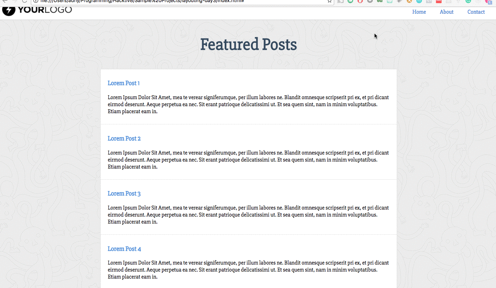

#Menghias Laman HTML dengan CSS

##Objectives

Dengan menggunakan CSS kamu dapat menghias halaman HTML. Pada latihan kali ini, kamu telah diberikan file CSS. Kamu diminta untuk membuat id atau class yang menjadi selector yang tepat di HTML!

##Directions

### 1. Membuat File HTML

Buatlah sebuah file HTML bernama *index.html* di sebuah folder bernama *project-css-styling*.
Gunakan kode yang sudah disiapkan berikut:

```html
<html>
  <head>
    <link href="style.css" rel="stylesheet" />
    <link href="https://fonts.googleapis.com/css?family=Slabo+27px" rel="stylesheet">
  </head>
  <body>
    <header>
      
      <nav>
        <ul>
          <a href="#"><li>Home</li></a>
          <a href="#"><li>About</li></a>
          <a href="#"><li>Contact</li></a>
        </ul>
      </nav>
    </header>
    <section>
      <h1>Featured Posts</h1>
      <div id="article-list">
        <article>
          <a href=""><h3>Lorem Post 1</h3></a>
          <p>
            Lorem Ipsum Dolor Sit Amet, mea te verear signiferumque, per illum labores ne. Blandit omnesque scripserit pri ex, et pri dicant eirmod deserunt. Aeque perpetua ea nec. Sit erant patrioque delicatissimi ut. Et sea quem sint, nam in minim voluptatibus. Etiam placerat eam in.
          </p>
        </article>
        <article>
          <a href=""><h3>Lorem Post 2</h3></a>
          <p>
            Lorem Ipsum Dolor Sit Amet, mea te verear signiferumque, per illum labores ne. Blandit omnesque scripserit pri ex, et pri dicant eirmod deserunt. Aeque perpetua ea nec. Sit erant patrioque delicatissimi ut. Et sea quem sint, nam in minim voluptatibus. Etiam placerat eam in.
          </p>
        </article>
        <article>
          <a href=""><h3>Lorem Post 3</h3></a>
          <p>
            Lorem Ipsum Dolor Sit Amet, mea te verear signiferumque, per illum labores ne. Blandit omnesque scripserit pri ex, et pri dicant eirmod deserunt. Aeque perpetua ea nec. Sit erant patrioque delicatissimi ut. Et sea quem sint, nam in minim voluptatibus. Etiam placerat eam in.
          </p>
        </article>
        <article>
          <a href=""><h3>Lorem Post 4</h3></a>
          <p>
            Lorem Ipsum Dolor Sit Amet, mea te verear signiferumque, per illum labores ne. Blandit omnesque scripserit pri ex, et pri dicant eirmod deserunt. Aeque perpetua ea nec. Sit erant patrioque delicatissimi ut. Et sea quem sint, nam in minim voluptatibus. Etiam placerat eam in.
          </p>
        </article>
        <article>
          <a href=""><h3>Lorem Post 5</h3></a>
          <p>
            Lorem Ipsum Dolor Sit Amet, mea te verear signiferumque, per illum labores ne. Blandit omnesque scripserit pri ex, et pri dicant eirmod deserunt. Aeque perpetua ea nec. Sit erant patrioque delicatissimi ut. Et sea quem sint, nam in minim voluptatibus. Etiam placerat eam in.
          </p>
        </article>
      </div>
    </section>
    <footer>
      <h5>copyright &copy; 2016 by HACKFOX</h5>
    </footer>
  </body>
</html>
```

### 2. Membuat File CSS

Buatlah sebuah file CSS bernama *style.css* pada folder yang sama dengan file *index.html* yang telah di hubungkan pada file html tersebut.

> `<link href="style.css" rel="stylesheet" type="text/css">`

### 3. Menyiapkan Aset Gambar

Buatlah sebuah folder di project tersebut dengan nama *img*, dimana kita akan meletakkan aset gambar kita disana. Aset gambar bisa kamu save as dari gambar di bawah ini:


### 4. Membuat Layout dan Desain

Sesuaikan kode html yang telah terhubung dengan css di atas, buatlah halaman HTML menjadi lebih bagus dan sesuai dengan tampilan di bawah ini!



> **Syntax Penting**
>  - color
>  - font-size
>  - font-family
>  - background
>  - font-weight
>  - text-align
>  - text-decoration
>  - position
>  - cursor
