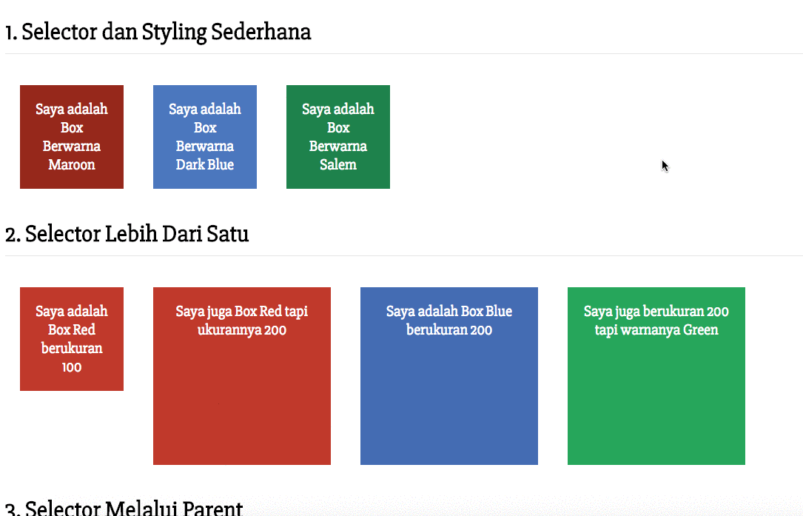

# Menghias Laman HTML dengan CSS

## Objectives

Dengan menggunakan CSS kamu dapat menghias halaman HTML. Pada latihan kali ini, kamu telah diberikan file CSS. Kamu diminta untuk membuat id atau class yang menjadi selector yang tepat di HTML!

## Directions

### 1. Membuat File HTML

Buatlah sebuah file HTML bernama *index.html* di sebuah folder bernama *project-css-styling*.
Gunakan kode yang sudah disiapkan berikut:

```html
<html>
  <head>
    <link href="https://fonts.googleapis.com/css?family=Slabo+27px" rel="stylesheet">
    <link href="style.css" rel="stylesheet" />
  </head>
  <body>
    <div class="separator">
      <h1>1. Selector dan Styling Sederhana</h1>
      <div>Saya adalah Box Berwarna Maroon</div>
      <div>Saya adalah Box Berwarna Dark Blue</div>
      <div>Saya adalah Box Berwarna Salem</div>
    </div>
    <div class="separator">
      <h1>2. Selector Lebih Dari Satu</h1>
      <div>Saya adalah Box Red berukuran 100</div>
      <div>Saya juga Box Red tapi ukurannya 200</div>
      <div>Saya adalah Box Blue berukuran 200</div>
      <div>Saya juga berukuran 200 tapi warnanya Green</div>
    </div>
    <div class="separator">
      <h1>3. Selector Melalui Parent</h1>
      <div>
        <div>Desain saya diatur oleh Parent Saya</div>
        <div>Desain saya diatur oleh Parent Saya</div>
        <div>Desain saya diatur oleh Parent Saya, tapi saya punya warna khusus, yaitu Gold!</div>
      </div>
    </div>
  </body>
</html>
```

### 2. Membuat File CSS

Buatlah sebuah file CSS bernama *style.css* pada folder yang sama dengan file *index.html* yang telah di hubungkan pada file html tersebut.

> `<link href="style.css" rel="stylesheet" type="text/css">`

Kamu **wajib** menggunakan kode CSS dibawah ini dan tidak mengubah apapun:

```css
/* Style Default */
body {
  font-family: 'Slabo 27px', serif;
}

h1 {
  border-bottom: 1px solid rgba(0, 0, 0, .1);
  padding-bottom: 10px;
}

.separator {
  width: 100%;
  height: auto;
  overflow: hidden;
}

/* Style Untuk Soal 1, 2, dan 3. Gunakan Dengan Sesuai! */

.box-100 {
  width: 100px;
  height: 100px;
  float: left;
  margin: 20px;
  padding: 20px;
  font-size: 15pt;
  text-align: center;
}

.box-200 {
  width: 200px;
  height: 200px;
  float: left;
  margin: 20px;
  padding: 20px;
  font-size: 15pt;
  text-align: center;
}

#maroon-box {
  color: #FFFFFF;
  background: #96281B;
}

#dark-blue-box {
  color: #FFFFFF;
  background: #4B77BE;
}

#salem-box {
  color: #FFFFFF;
  background: #1E824C;
}

.red-background {
  color: #FFFFFF;
  background: #C0392B;
}

.blue-background {
  color: #FFFFFF;
  background: #446CB3;
}

.green-background {
  color: #FFFFFF;
  background: #26A65B;
}

.box-list div {
  width: 200px;
  height: 200px;
  float: left;
  margin: 20px;
  padding: 20px;
  font-size: 15pt;
  text-align: center;
  background: #353535;
  color: #FFFFFF;
}

#gold-box {
  border-radius: 20px;
  color: #353535;
  background: #F9BF3B;
}
```

### 3. Menambahkan Class dan Id yang sesuai di HTML!

CSS telah siap digunakan. Sekarang kamu harus menambahkan `class` atau `id` pada HTML element untuk memberikan desain kepada halaman HTML kita. Hasil akhir dari HTML yang dibuat harus tampil seperti berikut:



<!-- ### 4. Pengumpulan

Upload tugas project dalam bentuk zip dari folder *project-css-styling*! **Perhatian** Hanya gunakan zip, jangan upload file isi nya satu per satu ataupun dengan rar, 7z, ataupun kompresi lainnya.
 -->
> **Syntax Penting**
>  - class
>  - id
