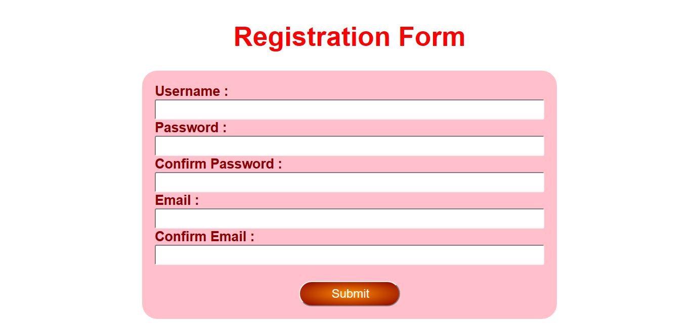
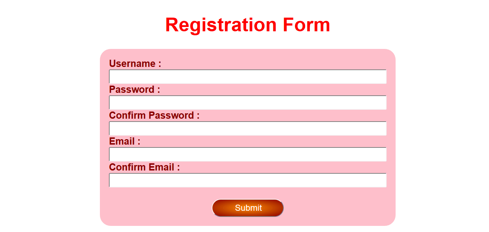

# Form Validation Sederhana dengan JavaScript

Setelah mengetahui tentang DOM kamu dapat menggunakan pengetahuan itu untuk melakukan banyak hal dalam web development, contohnya adalah Form Validation. Form validation dilakukan untuk memastikan input dari user sudah benar sebelum dikirimkan ke server. Untuk melatih pemahaman kamu tentang DOM, kerjakan tantangan ini dengan baik. Untuk saat ini kamu tidak perlu memikirkan cara mengirimkan data ke server.

## Objectives

- Mengerti Tentang DOM
- Mengetahui Cara Mengambil Data DOM
- Mengetahui Cara Menggunakan `document.getElementById()` dan event `onsubmit`

## Directions

- Buatlah suatu halaman HTML yang berisikan elemen input form `text`, `password`, dan `email` yang berfungsi seperti halaman registrasi sederhana. Lihat gambar di bawah sebagai contoh.



- Kamu boleh membuat style sesuai yang kamu inginkan. Namun jumlah element dan susunan harus sama dengan contoh.

- Buatlah sebuah fungsi JavaScript. Fungsi dipanggil dengan menambahkan event listener `submit` pada `<form>`. Function ini berfungsi untuk meng-handle input user dengan peraturan sebagai berikut:
    - Semua elemen tidak boleh kosong
    - Password dan Confirm Password harus sama
    - Email dan Email Confirm harus sama

- Pastikan form tidak men-submit data ketika validasi gagal. Untuk melakukan ini, apabila validasi gagal, gunakan `return false` di dalam fungsi yang kamu buat.

```HTML
<form action="#" id="main-form">
    ...
</form>
```

- Kamu boleh menambahkan aturan tambahan saat validasi. Misal, jumlah karakter username minimal 6 atau password harus terdiri dari huruf dan angka.

- Untuk melihat demo dari aplikasi yang selesai dibuat, perhatikan animasi di bawah ini.



### Tips

- Ketika membuat form, jangan lupa untuk menuliskan atribut `value` tanpa perlu menentukan nilainya.

- Untuk mendapatkan value dari DOM input panggil property `value` dan anggap `document.getElementById()` mengembalikan object.
