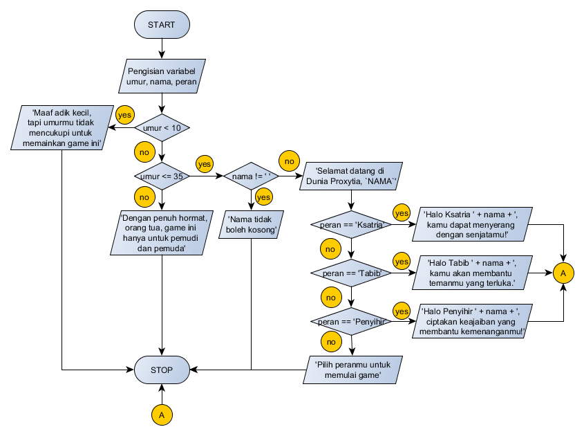

# 4. Menggunakan If Else 2

## Objectives

* Mengerti Cara Menggunakan *Nested* `If-Else`
* Mengerti Logika *Nested* `If-Else` 
* Mengerti Cara Menggunakan Operator Evaluasi `>`, `<`, `<=`, `>=`

## Directions

Game kamu semakin terkenal dan semakin banyak yang memainkan. Sayangnya semakin banyak anak kecil dan orang tua yang bermain, membuat pemain muda menjadi tidak nyaman. Oleh karena itu kamu harus mengimplementasikan mekanisme untuk mengecek variabel `umur`. Selain itu, diperlukan perubahan alur logika agar permainan menjadi lebih nyaman. Perhatikan *flowchart diagram* di bawah untuk alur program yang baru dan implementasikan ke dalam kode!

### Hints

> * Variabel tetap di-input secara manual.
> * Tambahkan variabel `umur`
