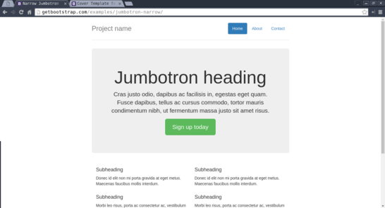
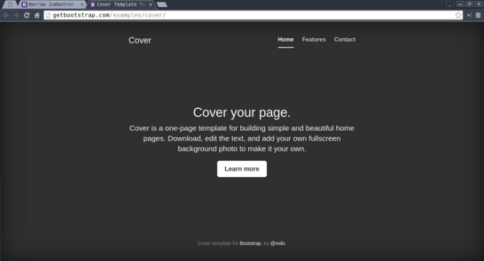

# Trying Bootstrap

## Objectives

Pada tantangan ini tidak terdapat tujuan spesifik, tujuannya hanya untuk memberi kesempatan bagi kamu untuk mencoba-coba dan bereksplorasi tanpa bimbingan spesifik.

- ▢ Memahami kegunaan framework.
- ▢ Memasang framework Bootstrap pada project.
- ▢ Menggunakan komponen Bootstrap yang sudah siap pakai.
- ▢ Berlatih membaca dokumentasi dari sebuah tool, library, framework, atau aplikasi.

## Directions

### 1. Download Bootstrap

[Cek website Bootstrap](http://getbootstrap.com) terlebih dahulu. Lalu [download Bootstrap](http://getbootstrap.com/getting-started/#download), [versi terbaru](https://github.com/twbs/bootstrap/releases/download/v3.3.6/bootstrap-3.3.6-dist.zip). Akan di-download sebuah zip yang kemudian perlu kamu ekstrak ke dalam folder yang sama dengan file HTML kita (`try-bootstrap.html` misalnya).

### 2. Melihat struktur bundle framework

Akan terdapat folder dengan struktur berikut:

```
bootstrap/
├── css/
│   ├── bootstrap.css
│   ├── bootstrap.css.map
│   ├── bootstrap.min.css
│   ├── bootstrap.min.css.map
│   ├── bootstrap-theme.css
│   ├── bootstrap-theme.css.map
│   ├── bootstrap-theme.min.css
│   └── bootstrap-theme.min.css.map
├── js/
└── fonts/
```

### 3. Memasang Bootstrap ke dalam project kita

Pindahkan file `bootstrap.min.css` dan `bootstrap-theme.min.css` ke bagian root dari project kita

### 4. Menggunakan Boostrap pada halaman

Panggil kedua file tersebut dengan tag `<link rel="stylesheet>`

### 5. Mencoba berbagai macam contoh

Cobalah untuk [mengambil berbagai contoh/examples yang tersedia](http://getbootstrap.com/getting-started/#examples) pada dokumentasi tersebut. Misalnya "Narrow Jumbotron" atau "Cover".





### 6. Bereksperimen

Ubahlah konten dan style template tersebut sesuka hati. Misalnya dengan tujuan memperkenalkan diri Anda. [Silakan baca dokumentasi CSS-nya](http://getbootstrap.com/css) untuk lebih tahu apa saja yang dapat kita gunakan.

Selamat! Kamu dapat berhasil membuat website dengan singkat namun dengan layout yang bagus. Terima kasih Bootstrap!
