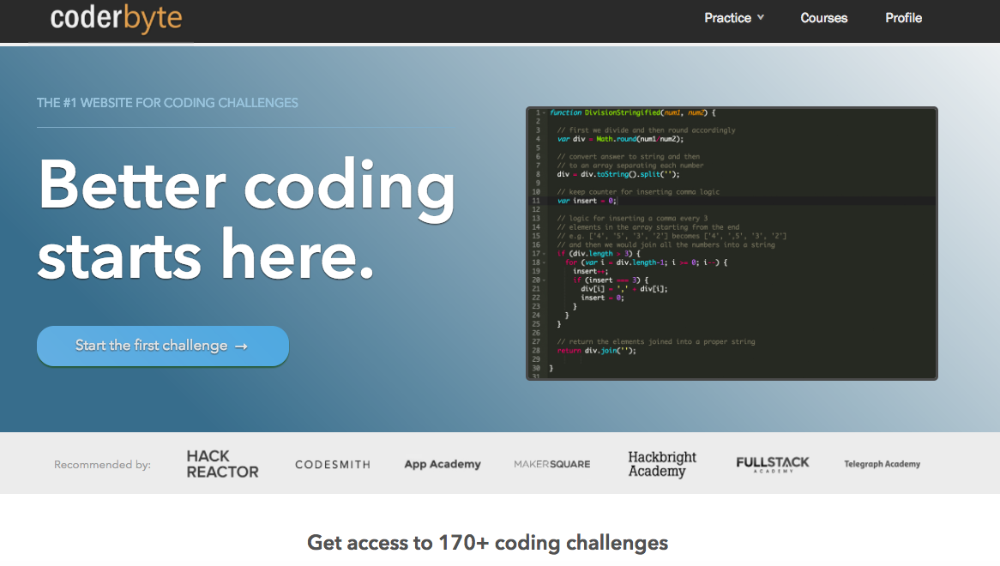
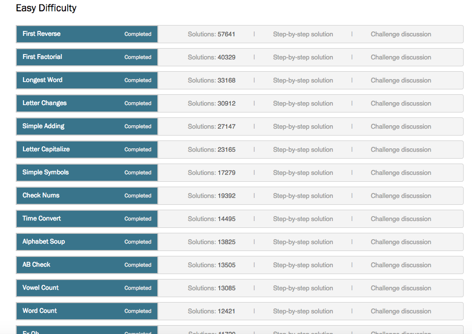
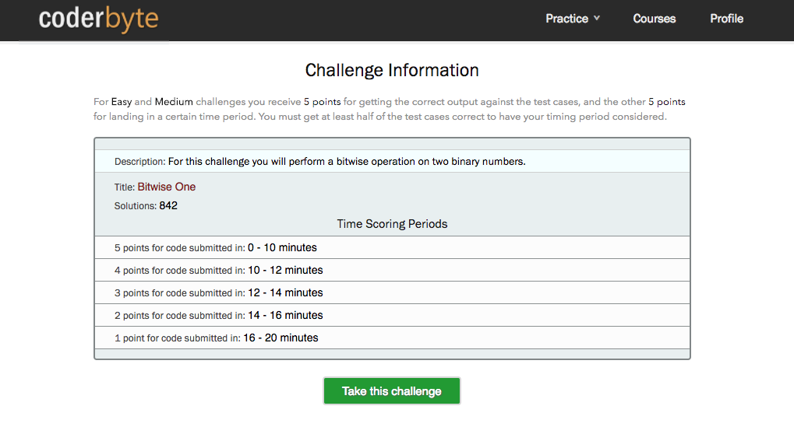
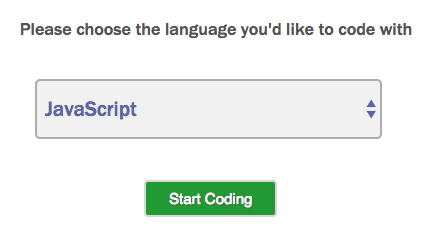
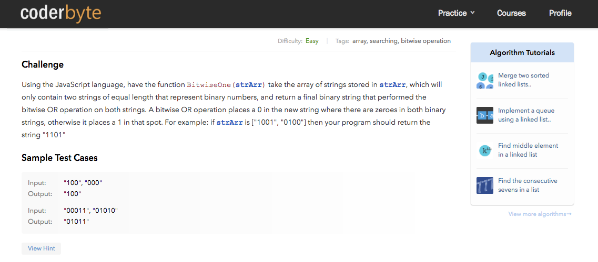
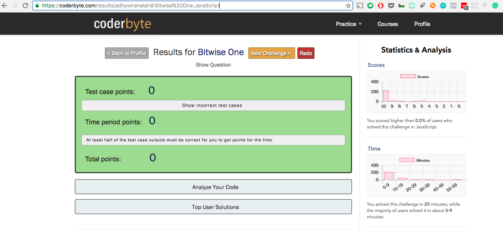

# Panduan Menggunakan Coderbyte

## Objectives

- ▢ Mengenal coderbyte dan cara kerjanya
- ▢ Mampu mengerjakan dan mengumpulkan tugas dari coderbyte sesuai instruksi

## Learnings

### Mengenal Coderbyte

Coderbyte adalah sebuah platform yang bermanfaat untuk mempersiapkan diri seseorang untuk bergabung ke dalam coding bootcamps. Platform ini telah banyak dimanfaatkan oleh berbagai coding bootcamp di luar negeri, seperti Hack Reactor, Fullstack Academy, Codesmith, dan lain-lain. Kamu akan memanfaatkan platform ini juga untuk mempersiapkan diri bergabung di Phase 1 HACKTIV8.

### Pendaftaran Account Coderbyte

Kamu bisa mendaftar akun Coderbyte sendiri, namun akun tersebut bersifat free dan memiliki akses yang sangat terbatas. Bagi murid Phase 0 yang aktif berada di batch tertentu, HACKTIV8 telah menyediakan akses tersebut, sehingga kamu tidak perlu mendaftar kembali, namun kamu hanya perlu login ke platform saja.

### Mengerjakan Challenge di Coderbyte

Kamu bisa mengerjakan berbagai macam challenge di Coderbyte, namun yang wajib kamu selesaikan adalah challenge yang kami tugaskan setiap hari-nya. Setiap tugas diberikan link yang langsung akan merujuk ke halaman challenge Coderbyte.

Untuk dapat dengan lancar mengerjakan challenge di Coderbyte, kamu harus perhatikan beberapa panduan di bawah ini:

- Challenge List

  

  Gambar di atas menunjukkan list tantangan yang tersedia di Coderbyte. Kamu boleh saja mencoba mengerjakan semuanya, namun pastikan kamu menyelesaikan tantangan yang wajib kamu kerjakan. Kamu akan masuk ke detil sebuah tantangan apabila kamu mengklik salah satu dari list tersebut.

- Challenge Details

  

  Gambar di atas menunjukkan detil tantangan yang kamu pilih Coderbyte.

- Challenge Language Picker

  

  Gambar di atas menunjukkan halaman dimana kamu harus memilih bahasa apa yang akan kamu gunakan untuk menyelesaikan tantangan tersebut. **Kamu wajib menggunakan JavaScript.**

- Challenge Page

  

  Gambar di atas menampilkan soal tantangan yang harus kamu kerjakan, dan waktu pengerjaan dihitung semenjak kamu masuk ke halaman ini.

- Challenge Code Editor

  

  Gambar di atas masih di halaman Challenge (posisinya di bawah soal). Ini, kamu harus mengerjakan tantangannya. Kamu bisa mengerjakannya di text editormu terlebih dahulu dan mengetest nya dengan nodeJS ataupun dengan jsbin lalu kemudian copy-paste ke sini. **Pastikan kamu tidak mengubah code diluar function yang harus kamu kerjakan.**

- Challenge Result

  

  Gambar di atas akan muncul setelah kamu telah submit codemu. Sistem akan mengevaluasi dan memberikan score yang dinilai berdasarkan seberapa tepat code-mu menjawab soal, berapa banyak lines-of-code yang kamu buat, dan berapa lama kamu mengerjakannya. Apabila nilai dari coderbyte kurang memuaskanmu, kamu bisa mengerjakan ulang. **Kami tidak akan mengurangi nilai apabila kamu berkali-kali mengerjakan soal yang sama, kami akan mengambil nilai terbaik.** Coderbyte menyediakan solution code, namun mengerjakan soal tantangan dengan kemampuanmu sendiri adalah tanggung jawabmu sendiri, karena mengandalkan solution code tidak akan membuatmu terlatih. **Mulai Week 3, kami ada sesi live coding online yang akan mengetest kemampuan coding dan logikamu. Apabila kamu mendapat nilai baik dengan mengandalkan solution code namun gagal di live coding, akan sulit bagi kami untuk melanjutkanmu ke phase 1.** Lebih baik kamu bertanya dan dimentoring oleh instuktur hingga kamu terlatih ketimbang melihat solution code.

  HACKTIV8 Challenge Point Calculation:

  - 100: Coderbyte Test Case Point: 5
  - 85: Coderbyte Test Case Point: 4
  - 50: Coderbyte Test Case Point: 3
  - 0: Coderbyte Test Case Point: < 3
