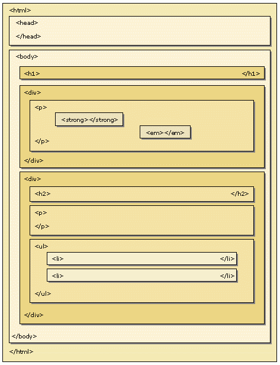

# Transversing in Document Object Model (DOM)

## Objectives

Di layout HTML yang cukup kompleks, kita akan bertemu dengan banyak element HTML yang memiliki hubungan parent-child yang dalam, dan pada saat kita menggunakan JavaScript untuk menseleksi atau memanipulasinya, tidak mungkin kita harus memberikan id atau class ke semua element-nya. Kita bisa menseleksi element HTML dari parent atau dari childnya. Untuk lebih dalam memahami hal ini, kamu harus telah mengerti hierarki parent-child yang terjadi di susunan HTML. Tapi tenang saja, kita akan mengulas ulang hal tersebut.

**DOM Transversing**

- ▢ mereview Hierarki Parent-Child di HTML
- ▢ menjelajah DOM dengan hubungan Parent, Child, dan Sibling

## Learnings

### 1. Hierarki Layout HTML

Hierarki layout HTML adalah bagaimana sebuah element HTML saling terkait satu sama lain. Untuk beberapa element, dapat terkandung di dalam element HTML lain. Hal inilah yang disebut sebagai element parent-child. Element HTML yang terkandung di dalam element HTML lain, adalah child/anak dari element induk nya tersebut.



Contoh gambar di atas merupakan gambaran sederhana dari sebuah layout HTML. Apabila layout di atas kita coba konversikan ke dalam kode HTMl, akan seperti kode di bawah ini (untuk kebutuhan kode, ditambahkan id untuk beberapa div):

**js-dom-transversing.html**
```html
<html>
  <head></head>
  <body>
    <h1></h1>
    <div id="contoh-div-1">
      <p id="contoh-p-1">
        <strong></strong>
        <em></em>
      </p>
    </div>
    <div id="contoh-div-2">
      <h2></h2>
      <p id="contoh-p-2"></p>
      <ul>
        <li></li>
        <li></li>
      </ul>
    </div>
    <script src="dom-transverse-1-intro.js"></script>
    <script src="dom-transverse-2-siblings.js"></script>
    <script src="dom-transverse-3-chaining-selectors.js"></script>
  </body>
</html>
```

Bisa kita lihat seperti visualisasi layout web page dan code di atas, satu element HTML menjadi child untuk yang lainnya. Terkait relasi parent-child, ada juga relasi yang dinamakan sibling. Sibling adalah "saudara" dari sebuah child, yang memiliki parent yang sama. Jika kita analogikan dalam sebuah keluarga sebagai seorang anak atau sebuah child, sibling adalah adik atau kakak kandung kita, dan parent adalah orang tua kandung kita. Di bawah ini di jelaskan peran masing-masing element HTML di atas dalam susunan hierarki nya.

- **`<html>`**                  : merupakan parent paling atas
- **`<head>`**                  : merupakan child dari `<html>`
- **`<body>`**                  : merupakan child dari `<html>`, sibling dari `<head>`
- **`<h1>`**                    : merupakan child dari `<body>`
- **`<div id="contoh-div-1">`** : merupakan child dari `<body>`, sibling dari `<h1>`
- **`<p id="contoh-p-1"> `**    : merupakan child dari `<div id="contoh-div-1">`
- **`<strong>`**                : merupakan child dari `<p id="contoh-p-1">`
- **`<em>`**                    : merupakan child dari `<p id="contoh-p-1">`, sibling dari `<strong>`
- **`<div id="contoh-div-2">`** : merupakan child dari `<body>`, sibling dari `<h1>` dan `<div id="contoh-div-1">`
- **`<h2>`**                    : merupakan child dari `<div id="contoh-div-2">`
- **`<p id="contoh-p-2">`**     : merupakan child dari `<div id="contoh-div-2">`, sibling dari `<h2>`
- **`<ul>`**                    : merupakan child dari `<div id="contoh-div-2">`, sibling dari `<h2>` dan `<p id="contoh-p-2">`
- **`<li>`**                    : merupakan child dari `<ul>`

### 2. Menjelajah DOM

Saatnya kita belajar menjelajah DOM memanfaatkan parent, child, dan sibling.

#### 2.1 Parent - Child

Untuk mulai mengenai transerving atau penjelajahan di dalam DOM, kita coba mulai dengan menjelajahi hubungan Parent - Child. Contoh pertama kita mulai dengan menseleksi `<body>` dan mendapatkan element HTML apa saja yang menjadi children dari `<body>`.

**dom-transverse-1-intro.js (part 1)**
```javascript
/*
====================================================
 Menseleksi DOM berdasarkan hubungan Parent - Child
====================================================
*/

// Menseleksi element <body>
var body = document.body;

// Mendapatkan element children dari <body>
var bodyChilds = body.children;

// Menampilkan DOM yang menjadi child dari <body> dalam bentuk array
console.log(bodyChilds); // h1, div id="contoh-div-1", div id="contoh-div-2", scripts js
```

Berdasarkan potongan kode di atas, kita berhasil mendapatkan children dari `<body>`, yaitu `<h1>`, `<div id="contoh-div-1">`, `<div id="contoh-div-2">` dan `<script>`.

Sekarang coba kita update lagi kode kita untuk mendapatkan contoh penjelajahan lain.

**dom-transverse-1-intro.js (part 2)**
```javascript
/*
====================================================
 Menseleksi DOM berdasarkan hubungan Parent - Child
====================================================
*/

// Menseleksi element <body>
var body = document.body;

// Mendapatkan element children dari <body>
var bodyChilds = body.children;

// Menampilkan DOM yang menjadi child dari <body> dalam bentuk array
console.log(bodyChilds);

// Menseleksi element <div id="contoh-div-1">
var contohDiv1 = document.getElementById('contoh-div-1');

// Mendapatkan element children dari <div id="contoh-div-1"> dalam bentuk array
var contohDiv1Childs = contohDiv1.children;

// Mendapatkan child pertama dari <div id="contoh-div-1">
var contohDiv1FirstChild = contohDiv1Childs[0];
console.log(contohDiv1FirstChild); // <p id="contoh-p-1">...</p>

// Note: Walaupun children mungkin hanya 1 element, tetap tertampung dalam array!
```

Disini kita mencoba mengakses salah satu children dan menambilkannya ke console sebagai HTML element, dengan menakses index dari array children yang sesuai. Ingat, setiap kita menggunakan `.children`, kita pasti mendapatkan nilai berupa array yang berisikan berbagai HTML elements.

Bagaimana mengakses semua nilai dari children? Kita tinggal menggunakan looping seperti contoh berikut:

**dom-transverse-1-intro.js (part 3)**
```javascript
/*
====================================================
 Menseleksi DOM berdasarkan hubungan Parent - Child
====================================================
*/

// Menseleksi element <body>
var body = document.body;

// Mendapatkan element children dari <body>
var bodyChilds = body.children;

// Menampilkan DOM yang menjadi child dari <body> dalam bentuk array
console.log(bodyChilds);

// Menseleksi element <div id="contoh-div-1">
var contohDiv1 = document.getElementById('contoh-div-1');

// Mendapatkan element children dari <div id="contoh-div-1"> dalam bentuk array
var contohDiv1Childs = contohDiv1.children;

// Mendapatkan child pertama dari <div id="contoh-div-1">
var contohDiv1FirstChild = contohDiv1Childs[0];
console.log(contohDiv1FirstChild); // <p id="contoh-p-1">...</p>

// Note: Walaupun children mungkin hanya 1 element, tetap tertampung dalam array!

// Menseleksi element <div id="contoh-div-2">
var contohDiv2 = document.getElementById('contoh-div-2');

// Mendapatkan element children dari <div id="contoh-div-2"> dalam bentuk array
var contohDiv2Childs = contohDiv2.children;

for(var n = 0; n < contohDiv2Childs.length; n++) {
  var contohDiv2NthChild = contohDiv2Childs[n];
  console.log(contohDiv2NthChild);
}
```

Kamu berhasil mendapatkan seluruh children dari `<div id="contoh-div-2">` dengan looping!

Dari awal kita mencoba mengakses children dari parent nya. Bagaimana dengan mengakses parent melalui child nya? tentu bisa!

**dom-transverse-1-intro.js (part 4)**
```javascript
/*
====================================================
 Menseleksi DOM berdasarkan hubungan Parent - Child
====================================================
*/

// Menseleksi element <body>
var body = document.body;

// Mendapatkan element children dari <body>
var bodyChilds = body.children;

// Menampilkan DOM yang menjadi child dari <body> dalam bentuk array
console.log(bodyChilds);

// Menseleksi element <div id="contoh-div-1">
var contohDiv1 = document.getElementById('contoh-div-1');

// Mendapatkan element children dari <div id="contoh-div-1"> dalam bentuk array
var contohDiv1Childs = contohDiv1.children;

// Mendapatkan child pertama dari <div id="contoh-div-1">
var contohDiv1FirstChild = contohDiv1Childs[0];
console.log(contohDiv1FirstChild); // <p id="contoh-p-1">...</p>

// Note: Walaupun children mungkin hanya 1 element, tetap tertampung dalam array!

// Menseleksi element <div id="contoh-div-2">
var contohDiv2 = document.getElementById('contoh-div-2');

// Mendapatkan element children dari <div id="contoh-div-2"> dalam bentuk array
var contohDiv2Childs = contohDiv2.children;

for(var n = 0; n < contohDiv2Childs.length; n++) {
  var contohDiv2NthChild = contohDiv2Childs[n];
  console.log(contohDiv2NthChild);
}

// Menseleksi element <p id="contoh-p-1">
var contohP1 = document.getElementById('contoh-p-1');
console.log(contohP1);

var contohP1Parent = contohP1.parentNode;
console.log(contohP1Parent); // <div id="contoh-div-1">
```

Selamat! Kamu telah berhasil mengkases parent -> child dan sebaliknya, child -> parent. Kamu mulai dapat memahami cara kerja penjelajahan DOM! Saatnya kita lanjut ke relasi selanjutnya, yaitu siblings!

#### 2.2 Siblings

Apabila sebelumnya kita mempelajari hubungan DOM sebagai parent dan child, sekarang kita akan membahas tentang hubungan antar sibling. Sibling, layaknya saudara kandung dalam analogi keluarga, merupakan DOM yang merupakan child dari parent yang sama.

Tetap menggunakan halaman HTML yang sama dengan script js yang berbeda, kita coba buat beberapa kode yang menunjukkan hubungan antar sibling.

**dom-transverse-2-siblings.js (part 1)**
```javascript
/*
=============================================
 Menseleksi DOM berdasarkan hubungan Sibling
=============================================
*/

// Menseleksi element <div id="contoh-div-1">
var contohDiv1 = document.getElementById('contoh-div-1');

// Mendapatkan sibling setelah <div id="contoh-div-1">
var contohDiv1NextSibling = contohDiv1.nextElementSibling;

console.log(contohDiv1NextSibling); // <div id="contoh-div-2">...</div>
```

dengan menggunakan `.nextElementSibling`, kita bisa mendapatkan sibling yang berada setelah DOM yang kita seleksi. Selanjutnya, kita akan mencoba mendapatkan sibling yang berada sebelum DOM yang kita seleksi.

**dom-transverse-2-siblings.js (part 2)**
```javascript
/*
=============================================
 Menseleksi DOM berdasarkan hubungan Sibling
=============================================
*/

// Menseleksi element <div id="contoh-div-1">
var contohDiv1 = document.getElementById('contoh-div-1');

// Mendapatkan sibling setelah <div id="contoh-div-1">
var contohDiv1NextSibling = contohDiv1.nextElementSibling;

console.log(contohDiv1NextSibling); // <div id="contoh-div-2">...</div>

// Mendapatkan sibling sebelum <div id="contoh-div-1">
var contohDiv1PrevSibling = contohDiv1.previousElementSibling;

console.log(contohDiv1PrevSibling); // <h1></h1>
```

Itu saja yang penting mengenai siblings. Ingat, jika kamu mencoba mengakses sibling yang tidak ada, akan menghasilkan nilai `null`!

### 2.3 Menjelajah DOM lebih dalam

Sebelumnya, untuk mengakses child, parent, atau sibling kita masih mengakses element yang satu tingkat didalam, diluar, atau disebelahnya. Bagaimana jika kita ingin menjelajah element dengan tingkat yang lebih dalam? Kamu bisa menggunakan cara biasa, dengan mengakses element satu tingkat satu per satu, atau menelusurinya lebih dalam sekaligus, dengan selector beruntun atau disebut juga chaining selectors.

**dom-transverse-3-chaining-selectors.js (Part 1)**
```javascript
/*
============================
 Menseleksi DOM Lebih Dalam
============================
*/

/*
1. Parent -> Child -> Child cara biasa
*/

// Menseleksi element <div id="contoh-div-1">
var contohDiv1 = document.getElementById('contoh-div-1');
console.log(contohDiv1);

// Mendapatkan <p id="contoh-p-1"> di dalam <div id="contoh-div-1">
var contohP1 = contohDiv1.children[0];
console.log(contohP1);

// Mendapatkan <strong> di dalam <p id="contoh-p-1">
var strongElem = contohP1.children[0];
console.log(strongElem);
```

Cara ini tentu paling mudah dibaca, namun seringkali kita membutuhkan cara yang lebih cepat dan praktis, yaitu menggunakan chaining selectors!

**dom-transverse-3-chaining-selectors.js (Part 2)**
```javascript
/*
============================
 Menseleksi DOM Lebih Dalam
============================
*/

/*
1. Parent -> Child -> Child cara biasa
*/

// Menseleksi element <div id="contoh-div-1">
var contohDiv1 = document.getElementById('contoh-div-1');
console.log(contohDiv1);

// Mendapatkan <p id="contoh-p-1"> di dalam <div id="contoh-div-1">
var contohP1 = contohDiv1.children[0];
console.log(contohP1);

// Mendapatkan <strong> di dalam <p id="contoh-p-1">
var strongElem = contohP1.children[0];
console.log(strongElem);

/*
2. Parent -> Child -> Child dengan Chaining Selector
*/

// Menggunakan chaining selector atau selektor beruntun.
console.log(contohDiv1.children[0].children[0]);
```

Lebih praktis dan mudah kan? Sekarang bagaimana dengan relasi siblings?

**dom-transverse-3-chaining-selectors.js (Part 3)**
```javascript
/*
============================
 Menseleksi DOM Lebih Dalam
============================
*/

/*
1. Parent -> Child -> Child cara biasa
*/

// Menseleksi element <div id="contoh-div-1">
var contohDiv1 = document.getElementById('contoh-div-1');
console.log(contohDiv1);

// Mendapatkan <p id="contoh-p-1"> di dalam <div id="contoh-div-1">
var contohP1 = contohDiv1.children[0];
console.log(contohP1);

// Mendapatkan <strong> di dalam <p id="contoh-p-1">
var strongElem = contohP1.children[0];
console.log(strongElem);

/*
2. Parent -> Child -> Child dengan Chaining Selector
*/

// Menggunakan chaining selector atau selektor beruntun.
console.log(contohDiv1.children[0].children[0]);

/*
3. Element -> previous sibling -> previous sibling cara biasa
*/

// Menseleksi element <div id="contoh-div-1">
contohDiv1 = document.getElementById('contoh-div-1');
console.log(contohDiv1);

// Mendapatkan <h1></h1> yang berada sebelum <div id="contoh-div-1">
var h1Elem = contohDiv1.previousElementSibling;
console.log(h1Elem); // <h1></h1>

// Mendapatkan null, dengan mengakses previous sibling dari <h1></h1>
var justNull = h1Elem.previousElementSibling;
console.log(justNull); // null
```

Lalu, lanjut dengan cara method selectors untuk siblings!

**dom-transverse-3-chaining-selectors.js (Part 4)**
```javascript
/*
============================
 Menseleksi DOM Lebih Dalam
============================
*/

/*
1. Parent -> Child -> Child cara biasa
*/

// Menseleksi element <div id="contoh-div-1">
var contohDiv1 = document.getElementById('contoh-div-1');
console.log(contohDiv1);

// Mendapatkan <p id="contoh-p-1"> di dalam <div id="contoh-div-1">
var contohP1 = contohDiv1.children[0];
console.log(contohP1);

// Mendapatkan <strong> di dalam <p id="contoh-p-1">
var strongElem = contohP1.children[0];
console.log(strongElem);

/*
2. Parent -> Child -> Child dengan Chaining Selector
*/

// Menggunakan chaining selector atau selektor beruntun.
console.log(contohDiv1.children[0].children[0]);

/*
3. Element -> previous sibling -> previous sibling cara biasa
*/

// Menseleksi element <div id="contoh-div-1">
contohDiv1 = document.getElementById('contoh-div-1');
console.log(contohDiv1);

// Mendapatkan <h1></h1> yang berada sebelum <div id="contoh-div-1">
var h1Elem = contohDiv1.previousElementSibling;
console.log(h1Elem); // <h1></h1>

// Mendapatkan null, dengan mengakses previous sibling dari <h1></h1>
var justNull = h1Elem.previousElementSibling;
console.log(justNull); // null


/*
4. Element -> previous sibling -> previous sibling dengan chaining selector
*/

// Penggunaan chaining selector
console.log(contohDiv1.previousElementSibling.previousElementSibling); // null
```

Selamat, kamu telah mampu menjelajah DOM! Kamu bisa memanfaatkan ilmu ini untuk membuat aplikasi web yang sangat interaktif! :tada:
