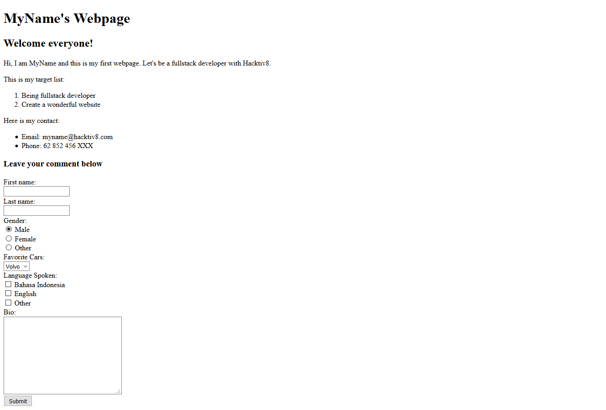

#Laman Web Pertamaku

##Objectives

Setelah mempelajari dasar-dasar HTML, kamu ditantang untuk membuat sebuah laman html sendiri menggunakan *tags* yang telah kamu pelajari. Laman pertama ini akan digunakan untuk tugas-tugas selanjutnya, pastikan kamu mengerjakannya dengan baik.

##Directions

### 1. Membuat File HTML

Buatlah sebuah file teks baru dengan nama **index** dengan format **html**.

 - [Kenapa harus index.html ?](https://www.quora.com/Why-is-the-default-html-file-called-index-html)

### 2. Mulai Coding!

Perhatikan gambar dibawah ini! Isi konten pada *index.html* seperti pada gambar dibawah. Hanya saja, ganti *MyName* dengan nama panggilan kamu. Have fun!

### 3. Kumpulkan Tugasmu

Bila kamu sudah menyelesaikan tantangan ini, kumpulkan dengan cara mengirim file *index.html* kepada **someone@mail.com** sebelum **due date**. 

