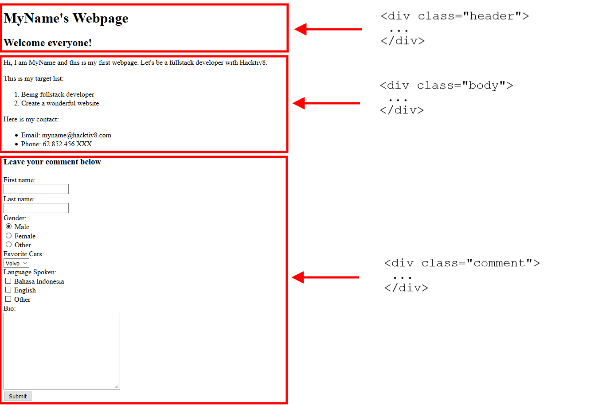
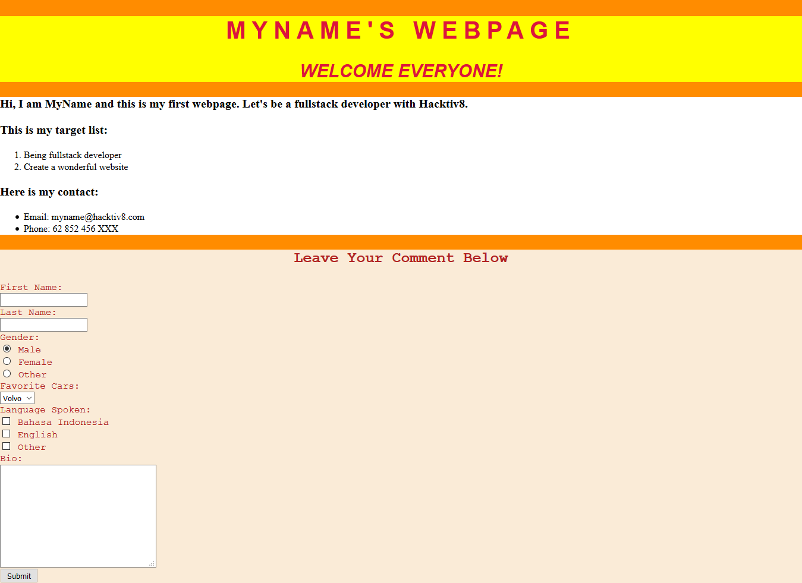

#Menghias Laman HTML dengan CSS 1

##Objectives

Dengan menggunakan CSS kamu dapat menghias halaman HTML yang sebelumnya sudah dibuat menjadi lebih cantik. Tantangan kali ini akan mengajak kamu untuk mengimplementasikan dasar-dasar CSS untuk dapat menghias sebuah halaman HTML menjadi lebih menarik.

##Directions

### 1. Membuat File CSS

Buatlah sebuah file CSS bernama *style.css* pada folder yang sama dengan file *index.html* dan tautkan pada file html tersebut.
	
> `<link href="style.css" rel="stylesheet" type="text/css">`

### 2. Membagi Kode HTML ke dalam *DIVs*

Sesuaikan kode html kamu dengan memasukkan beberapa bagian ke dalam tag div yang terpisah. Bagi sesuai dengan acuan gambar di bawah ini!



### 3. Hias Lamanmu!

Hiaslah laman html-mu dengan mengacu pada gambar di bawah ini. Isi file *style.css* dengan dengan syntax yang menurutmu perlu diterapkan. Kamu tidak perlu mengubah isi file *index.html* lagi.



> **Syntax Penting**
>  - color
>  - font-size
>  - font-family 
>  - background-color
>  - line-height
>  - word-spacing 
>  - font-weight 
>  - font-style 
>  - text-transform 
>  - text-align

 **Hints**

```css
body {
    background-color: darkorange;
}
/*font-family yang digunakan: Arial, Courier, serif*/
```

## References

* [HTML Color Picker](http://www.w3schools.com/colors/colors_picker.asp)
