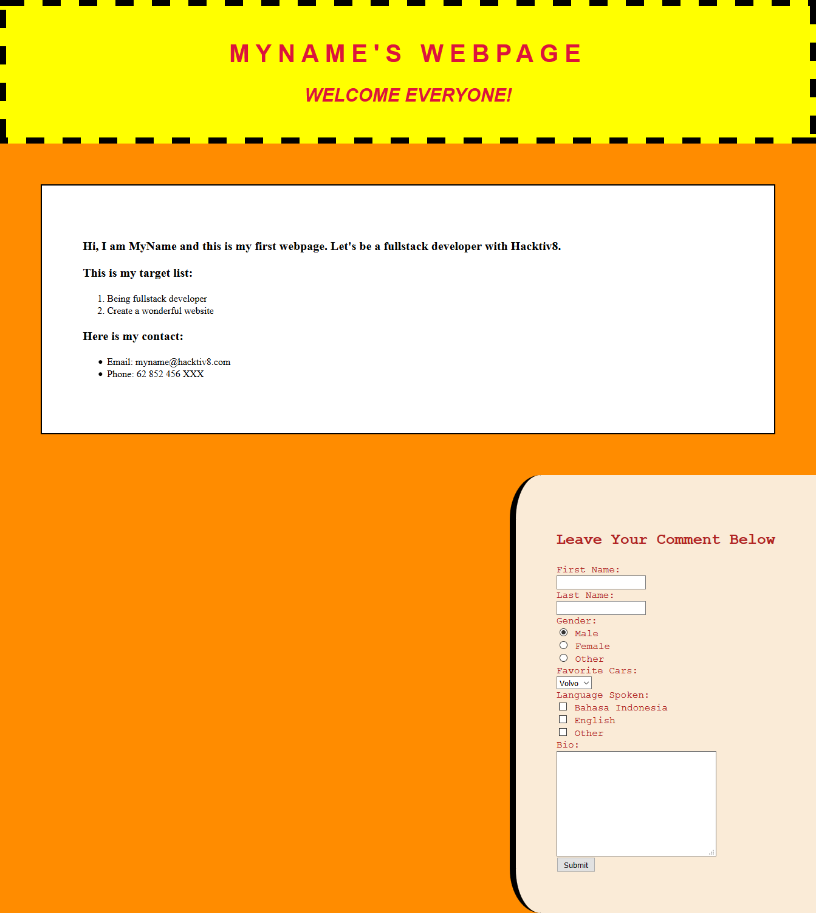

#Menghias Laman HTML dengan CSS 2

##Objectives

Setelah mempelajari mengenai Box Model dan *Element Positioning* dengan CSS, kamu ditantang untuk merapikan laman html yang telah kamu buat sebelumnya agar menjadi lebih rapi dan enak dilihat. 

##Directions

### 1. Perbarui File CSS

Tanpa Perlu mengubah isi file *index.html*, implementasikan syntax CSS pada file *style.css* agar lamanmu dapat menyerupai gambar dibawah ini.

> **Syntax Penting**
>  - box-sizing
>  - width
>  - height 
>  - padding / padding-*
>  - margin / margin-*
>  - float
>  - border / border-* 

## References

* [CSS Border](http://www.w3schools.com/css/css_border.asp)
* [CSS Margins](http://www.w3schools.com/css/css_margin.asp)
* [CSS Padding](http://www.w3schools.com/css/css_padding.asp)
* [CSS Box Model](http://www.w3schools.com/css/css_boxmodel.asp)
* [CSS Float](http://www.w3schools.com/css/css_float.asp)
