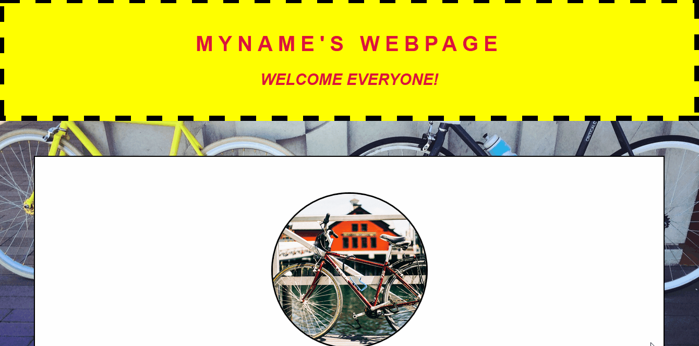

#Menghias Laman HTML dengan CSS 3

##Objectives

Laman HTML terasa kurang tanpa adanya gambar. Pada tugas ini kamu ditantang untuk menambahkan 2 elemen penting dalam HTML yaitu gambar dan tabel.

##Directions

### 1. Perbarui File HTML & CSS

Perhatikan gambar dibawah ini! Sesuaikan laman html yang sudah kamu buat sebelumnya agar dapat menyerupai gambar tersebut. Kamu sekarang boleh memodifikasi file *index.html* untuk menambahkan gambar. Kamu bebas memilih gambar yang kamu sukai.

> **Syntax Penting**
>  - background
>  - background-image
>  - background-size
>  - background-attachment
>  - -webkit-linear-gradient

## References

* [CSS Background](http://www.w3schools.com/css/css_background.asp)
* [CSS3 Gradients](http://www.w3schools.com/css/css3_gradients.asp)

