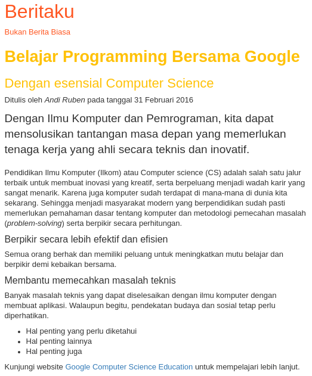

# Create a News Article

## Objectives

- ▢ Mempraktekkan pengetahuan HTML5 untuk membuat sebuah artikel berita sederhana.

Berikut contoh artikel berita sederhana dengan HTML dan CSS.



## Directions

### 1. Membuat halaman baru untuk berita

- ▢ Buatlah folder `news` pada root directory.
- ▢ Buatlah file `first-news.html` di dalam folder tersebut.
- ▢ Rancanglah struktur dasar dokumen HTML dengan document type, `html`, `head`, dan `body`.
- ▢ Mulailah isi dengan tag header (`h1`-`h6`) dan paragraf (`p`).
- ▢ Isilah berbagai element yang ada dengan tulisan berita karangan sendiri.
- ▢ Tambahkan bagian penting lain seperti tanggal dan nama kamu sendiri.
- ▢ Gunakan elemen yang cocok diperlukan seperti list dan table jika relevan.

```
[USERNAME].github.io
├── news
│   └── first-news.html
├── images
├── index.html
└── styles
    └── index.css
```

### 2. Kirim berbagai perubahan yang ada ke website kamu

- ▢ Add, commit, dan push file HTML ke GitHub.
  - `git add news/first-news.html`
  - `git commit -m "Create the first news article"`
  - `git push`
- ▢ Cek halaman berita yang sudah dibuat.
- ▢ Share hasil kamu di Slack.

## References

- [Learn to Code HTML & CSS, by Shay How](http://learn.shayhowe.com/html-css)
- [HTML Tutorials, by TutorialsPoint](http://tutorialspoint.com/html)
- [DevDocs HTML Documentation](http://devdocs.io/html)
