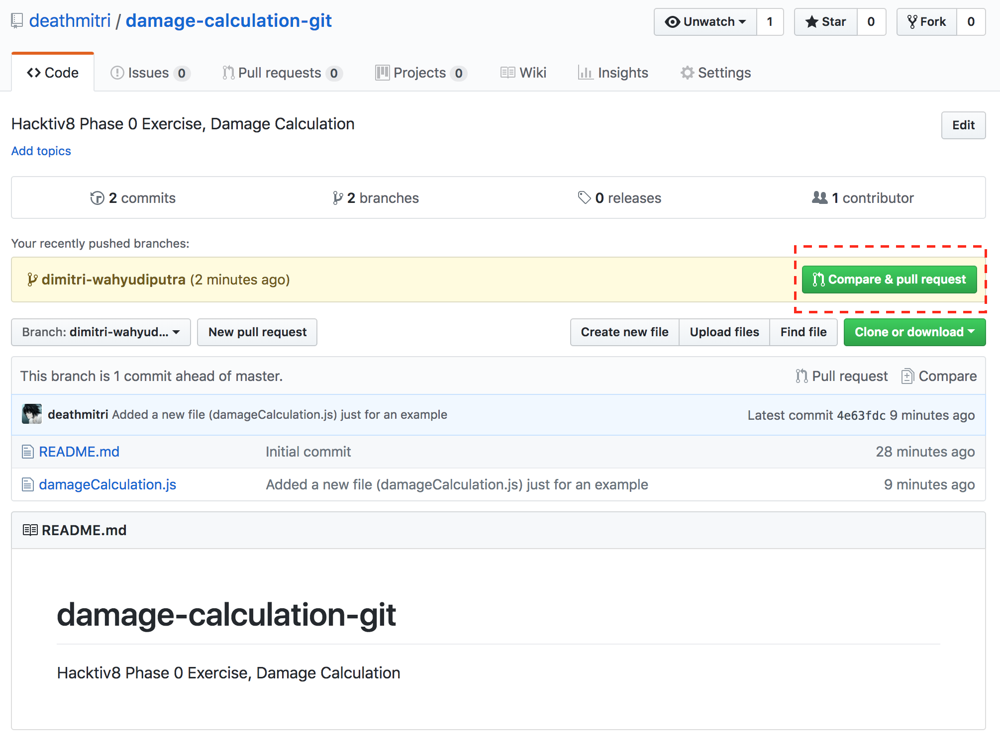
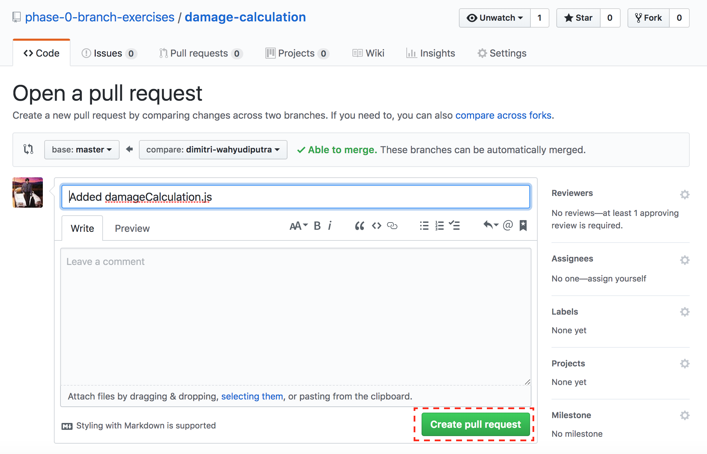
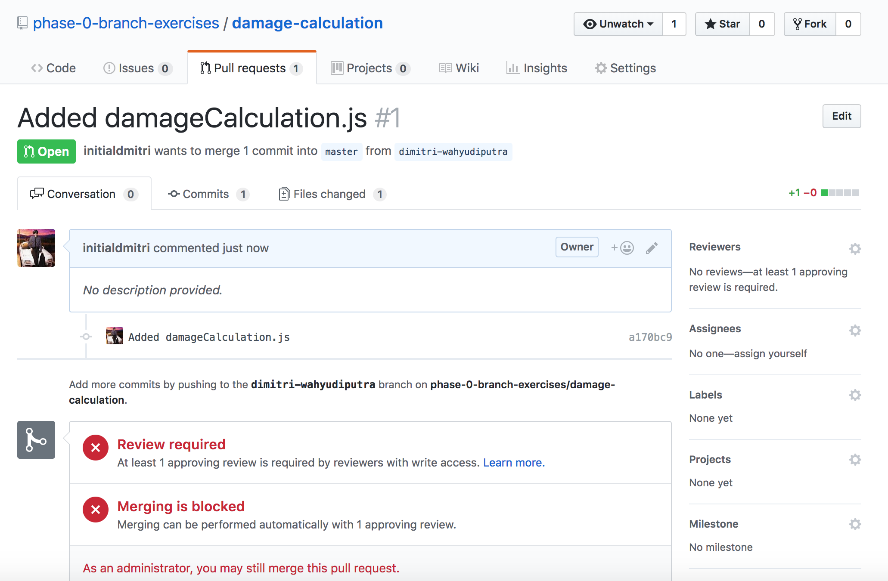

# Submit Exercise lewat Git Branch

1. Clone repository tugas yang ingin kamu kumpulkan, contoh ini akan menggunakan repository Damage Calculation

2. Buatlah branch baru dengan menjalankan perintah berikut:
   ```
   git checkout -b <nama_kamu>
   ```
   Contoh:
   ```
   git checkout -b dimitri-wahyudiputra
   ```
3. Check terlebih dahulu apakah kamu sudah masuk ke branch baru dengan memasukkan perintah berikut:
   ```
   git status
   ```
   Yang akan menampilkan output seperti ini:
   ```
   On branch <nama_kamu>
   nothing to commit, working tree clean
   ```
4. Kerjakan tugas Damage Calculation di branch ini dan jika sudah selesai, lakukan `git add` dan `git commit` seperti yang kalian biasa lakukan.

5. Jalankan perintah untuk melakukan push ke branch kamu
   ```
   git push origin <nama_kamu>
   ```

6. Lakukan `Pull Request` dari halaman repository damage-calculation-git dengan cara klik tombol `Compare & pull request`

   

6. Tambahkan message dan klik button `Create pull request`

   

7. Selesai! Jika kamu sudah melakukan step ke-8, maka akan redirect ke halaman ini

   
