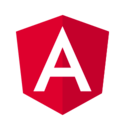
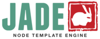

# Explore Various Tooling on Web Development

## Objectives

Terkait lebih dalam dan jauh mengenai tooling yang bermanfaat, pedoman ini didedikasikan untuk menyertakan hal-hal apa saja yang membantu kita mencapai kualitas website, kode program, dan aplikasi yang baik.

- ▢ Mengetahui Frontend Library dan Framework
- ▢ Mengetahui Frontend Application Library dan Framework
- ▢ Mengetahui Backend Application Library dan Framework
- ▢ Mengetahui Versioning
- ▢ Mengetahui Preprocessing dan Templating

## Learnings

### Mengetahui Berbagai Frontend Library dan Framework

Library (tak perlu diterjemahkan menjadi perpustakaan) dan framework atau rangka kerja memiliki banyak makna. Jika dicari lewat Google, mungkin akan ada banyak pendapat yang bisa membingungkan untuk pemula. Khusus untuk di dunia website, kita akan sederhanakan saja bahwa...

Library adalah sekumpulan komponen seperti function dan object, yang sudah dibuat sebelumnya oleh developer lain untuk memudahkan kita mengembangkan sesuatu tanpa harus membuat sesuatu tersebut dari nol/scratch. Sehingga kita bisa semudah menggunakan berbagai komponen tersebut dalam mengerjakan pengembangan website atau aplikasi. Misalnya fungsi untuk memperoleh element dengan code yang lebih singkat; fungsi untuk membuat animasi dengan mudah; dan sebagainya.

Begitupun dengan framework, memudahkan kita seperti itu, namun lebih fokus untuk mengarahkan kita bagaimana cara membuat website atau aplikasi sesuai dengan aturan, petunjuk, dan sifat dari pembuat/framework tersebut. Misalnya aturan untuk tampilan ukuran dan warna pada sebuah tombol; pengaturan layout dan jarak antar element; dan sebagainya.

Walaupun pada kenyataannya, istilah library dan framework banyak perdebatan antara kegunaannya berbeda atau sama saja. Yang jelas, mereka dibuat untuk memudahkan kita melakukan sesuatu tanpa kita harus membuat semuanya satu persatu.

Berikut contoh-contoh library dan framework yang paling relevan dalam pembuatan website sekarang ini. Ketiganya mirip-mirip dari segi kapabilitas; namun seperti perbandingan pizza atau burger, sama-sama makanan tapi rasanya berbeda. Berikut pun dengan berbagai tools lain yang akan kita bahas sekilas.

**Bootstrap**


[Bootstrap](http://getbootstrap.com) adalah framework HTML, CSS, dan JavaScript untuk mengembangkan proyek website yang responsive dan mobile-friendly. Kamu pasti tahu Twitter kan? Team dari Twitter lah yang membuat dan menggunakan Bootstrap pada website-nya.

**Zurb Foundation**


[Foundation](http://foundation.zurb.com) adalah alternatif dan pesaing Bootstrap. Foundation adalah framework frontend yang paling canggih serta responsif untuk device apapun. Memudahkan kita untuk mendesain website, aplikasi, dan email yang cantik dan keren.

**Semantic UI**


[Semantic UI](http://semantic-ui.com) lebih dari sekadar framework biasa. Ia juga merupakan sekumpulan tools (toolset) yang memungkinkan kita untuk mengatur styling dengan pendekatan bahasa yang bermakna (semantic) dalam mendesain antarmuka pengguna (User Interface) di web.

### Mengetahui Berbagai Frontend Application Library dan Framework

**jQuery**


jQuery memungkinkan kita untuk memudahkan berbagai keperluan yang berhubungan antara JavaScript dan DOM HTML seperti pengubahan, traversing, event handling, animation, dan lainnya. Secara lengkap, jQuery pun adalah kumpulan library yaitu [jQuery](https://jquery.com), [jQuery UI](https://jqueryui.com), dan [jQuery Mobile](https://jquerymobile.com); masing-masing dibuat dan digunakan sesuai kebutuhan. Fiturnya antara lain adalah cepat, ukurannya kecil, dan dapat di-extend dengan berbagai plugin.

Dengan jQuery, menulis code JavaScript menjadi lebih mudah. Sesuai namanya, kita seringkali menggunakan kueri (query). Misalnya yang sebelumnya dalam plain/vanilla JavaScript untuk mendapatkan element adalah seperti...

```javascript
document.getElementById("example");
// dan
document.getElementByClassName(".next")[0].innerHTML = "Selanjutnya";
```

dengan jQuery kita bisa menulisnya seperti ini saja...

```javascript
$("#example");
// dan
$(".next").html("Selanjutnya");
```

**Zepto.js**


Terdapat alternatif jQuery yang lebih ringan yaitu [Zepto.js](http://zeptojs.com) dan penggunaannya sangat mirip/compatible dengan jQuery.

**Modernizr**


Dalam hal web browser, terdapat masalah yang umum terjadi yaitu beberapa fitur belum di-support browser (terutama browser versi lama). Atau juga masalah tentang perbedaan bagaimana kita bisa membuat aplikasi web yang dapat berjalan di semua browser dengan lancar. Maka dari itu, diperlukan semacam penambah fitur untuk berbagai browser, yang kadang disebut _cross browser polyfill / shimmer_.

[Modernizr](https://modernizr.com) adalah library polyfill/shimmer yang paling populer digunakan untuk mendeteksi dan menambahkan fitur-fitur terbaru dari HTML, CSS, dan JavaScript kepada browser yang ada; terutama HTML5 dan CSS3.

**Angular.js**



Angular.js merupakan framework yang secara ajaib dapat menambah (extend) berbagai fungsionalitas dan view yang dinamis ke dalam HTML, sehingga dengan itu kita bisa membuat aplikasi yang hanya satu halaman HTML saja, kadang disebut _single page application_ (SPA). Fitur utamanya antara lain two-way data binding, templating, directives, model-view-controller (MVC), dependency injection, dll.

Kini pengembangannya yang awalnya dibuat oleh Google, terpisah antara [AngularJS versi 1](https://angularjs.org) dan [Angular versi 2](https://angular.io). Karena masih butuh waktu untuk para developer pindah dari versi 1 ke 2.

**React.js**


React merupakan library JavaScript yang fokus pada view atau antarmuka pengguna dari aplikasi web. Fitur utamanya yakni mengatasi masalah pembuatan aplikasi besar dengan data yang banyak berubah seiring waktu, dengan menggunakan pendekatan komponen (components) yang dapat digunakan berulang kali serta virtual DOM. React dikembangkan dan digunakan oleh Facebook serta Instagram.

Dalam bootcamp ini, kita akan fokus menggunakan React.js karena kapabilitasnya yang luar biasa hebat (awesome!) dan performanya yang sangat cepat.

**Lainnya**

Masih banyak lagi library dan framework yang perlu kita ketahui seiring waktu. Seperti Polymer, Backbone.js, Ember.js, Vue.js, dan Meteor. Tapi tak perlu khawatir untuk mempelajari semuanya, karena yang penting adalah cukup aware bahwa ada berbagai tools, library, dan framework lainnya di luar sana.

### Mengetahui Berbagai Backend Application Library dan Framework

Khusus untuk Fase 0, kita hanya cover bagian client-side atau backend, dalam browser saja. Sedangkan aplikasi web yang sesungguhnya memerlukan aplikasi server-side atau backend. Berikut beberapa library dan framework yang menggunakan teknologi JavaScript dengan Node.js.

**Express**


[Express.js](http://expressjs.com) adalah framework aplikasi Node.js yang sangat minimalis, ringan, dan fleksibel. Fleksibilitasnya yang luar biasa menjadikan Express dapat bekerja bersama atau digabungkan dengan library dan framework apapun dengan mudah.

**Feathers**


[Feathers](http://feathersjs.com) adalah framework minimalis yang dikembangkan berdasarkan Express, ditambah kemampuan real-time secara built-in. Feathers mengatasi fleksibilitas Express yang terlalu bebas, dengan membantu developer untuk langsung tinggal menggunakan modul/plugin yang siap pakai untuk mengembangkan aplikasi web dengan berbagai teknologi lain.

**Lainnya**

Dikarenakan sebenarnya sulit bagi web developer biasa untuk mengelola aplikasi web di bagian backend, maka terdapat platform online yang bisa dipakai dengan mudah untuk menjadi backend (disebut juga Backend-as-a-Service / BaaS). Salah satunya adalah [Firebase](https://firebase.google.com) yang sekarang dimiliki Google, adalah kumpulan tools dan infrastuktur yang siap pakai di cloud, untuk membuat aplikasi yang lebih baik serta menumbuhkan bisnis sekaligus. Alternatif lainnya seperti [Stamplay](https://stamplay.com).

### Memahami Versioning

Saat kita merilis kode atau aplikasi kita ke publik bahkan perusahaan sendiri sekalipun, kita harus menandai atau menamai perubahan dan perkembangan yang ada dengan versi (versioning). Penamaan versi sederhananya seperti `v1`, `v2`, dan seterusnya seiring perkembangan kode dan aplikasi yang kita buat. Ada juga yang menamainya sebatas `alpha` dan `beta` saja selanjutnya tidak diberi nama versi, yang walaupun mudah namun pada jangka panjang akan bermasalah.

Karena banyaknya variasi cara yang bisa kita pilih dan sepertinya harus dipikirkan, terdapat pedoman cara versioning populer bernama [Semantic Versioning](http://semver.org) yang bisa kita ikuti kemudian. Semantic Versioning merupakan sekumpulan aturan dan kebutuhan yang menjelaskan bagaimana kita sebaiknya mengatur angka dan simbol pada versi dengan semantik, memiliki makna dan penjelasan pada tiap versi.

### Mengetahui Berbagai Preprocessing dan Templating

Preprocessing merupakan konsep yang mirip dengan transpiling, dimana data masukan (dengan bahasa non-standard) akan diolah menjadi data keluaran (dengan bahasa standard).

Kemudian templating adalah semacam membuat code yang diberi kemampuan untuk menempatkan berbagai embedded expression, seperti placeholder, repeater, dan conditional. Di balik templating itupun ada templating engine yang mengolah berbagai kemampuan tersebut. Mirip dengan apa yang kita bisa lakukan dengan template literal string dahulu. Templating bisa diterapkan secara terpisah, namun seringkali berkaitan erat dengan preprocessing.

Untuk menggunakan tools-tools ini, diperlukan application platform seperti Node.js dan Ruby (tidak bisa langsung dengan JavaScript di client-side). Biasanya mereka dijalankan melalui terminal. Ada juga berbagai alternatif lainnya yang dibuat dengan Python atau Go jika kita mau.

**Untuk JavaScript: CoffeeScript dan TypeScript**


Kedua bahasa berikut muncul sebelum adanya ES2015/ES6, sehingga mereka menjadi referensi aturan JavaScript yang dikembangkan selanjutnya.

[CoffeeScript](http://coffeescript.org) adalah salah satu bahasa populer yang bisa ditranspilasi/dikompilasi menjadi JavaScript. Ia merupakan inspirasi dan cikal bakal fitur-fitur yang ada di ES2015/ES6 sekarang. Walaupun bahasanya terlihat ajaib, namun dapat menunjukkan berbagai fitur baik di JavaScript dengan cara yang elegan dan sederhana. Dengan CoffeeScript, hasil kode kita yang jadi JavaScript sudah bisa dijamin mudah dibaca dan cantik, bahkan seringkali berjalan lebih cepat.

[TypeScript](http://typescriptlang.org) adalah bahasa superset JavaScript yang juga akan dikompilasi menjadi JavaScript yang scalable dan dapat mencegah berbagai kesalahan umum yang terjadi pada saat kita menulis code. Dengan TypeScript, hasil aplikasi bisa lebih aman. TypeScript pada awalnya dikembangkan oleh Microsoft.

Berikut contoh code CoffeeScript yang kemudian di-compile menjadi JavaScript.

```coffeescript
race = (winner, runners...) ->
  print winner, runners
```

```javascript
var race,
  slice = [].slice;

race = function() {
  var runners, winner;
  winner = arguments[0], runners = 2 <= arguments.length ? slice.call(arguments, 1) : [];
  return print(winner, runners);
};
```

**Untuk HTML: Jade dan Haml**




Kedua bahasa berikut merupakan HTML preprocessor. Menjadikan sintaks HTML lebih sederhana dan memiliki berbagai fungsi tambahan. Yang tetap, ujung-ujungnya menjadi HTML normal. Jade dibuat dengan Node.js sedangkan Haml dengan Ruby.

Berikut contoh code Jade yang kemudian di-compile menjadi HTML.

```jade
doctype html
html(lang="en")
  head
    title= "Judul Website"
    script(type='text/javascript').
      if (numbers) {
         addition(1, 1)
      }
  body
    h1 Judul Post
    #container.col
      if newVisitor
        p Welcome!
      else
        p Welcome back!
      p.
        Sample paragraph
```

```html
<!DOCTYPE html>
<html lang="en">
  <head>
    <title>Judul Website</title>
    <script type="text/javascript">
      if (numbers) {
         addition(1, 1)
      }
    </script>
  </head>
  <body>
    <h1>Judul Post</h1>
    <div id="container" class="col">
      <p>Welcome back!</p>
      <p>Sample paragraph</p>
    </div>
  </body>
</html>
```

**Untuk CSS: LESS, Sass, dan Stylus**


Ketiga bahasa berikut merupakan CSS preprocessor. Menjadikan sintaks CSS lebih sederhana dan memiliki berbagai fungsi tambahan. Yang tetap, ujung-ujungnya menjadi CSS normal juga.

[Less](http://lesscss.org), [Sass](http://sass-lang.com), dan [Stylus](http://stylus-lang.com) adalah CSS preprocessor yang paling populer.
Dengen mereka, kita bisa mendapat kemampuan kemampuan CSS yang extended, menjadikan ita bisa menggunakan variabel, formular, dan function. Serta berbagai teknik yang menjadikan CSS kita lebih mudah dikelola, themable, dan bisa dibuat plugin(extendable). Less dan Stylus dibuat dengan Node.js, sedangkan Sass dengan Ruby.

Berikut contoh code Stylus yang kemudian di-compile menjadi CSS.

```stylus
body
  font: 12px Arial, sans-serif
a
  &.button
    border-radius: 5px
  &.small
    padding: 2px
```

```css
body {
  font: 12px Arial, sans-serif;
}
a.button {
  border-radius: 5px;
}
a.small {
  padding: 2px;
}
```

## References

- [HTML, CSS & JS Frameworks and when to use them, by Chris Wharton](https://chriswharton.me/2016/05/html-css-and-js-frameworks-use)
- [Front-end Hyperpolyglot, by Jeff Carp](https://jeffcarp.github.io/frontend-hyperpolyglot)
- [What is Semantic Versioning (SemVer)?, by AbdulFattaah Popoola](https://abdulapopoola.com/2015/10/26/what-is-semver)
