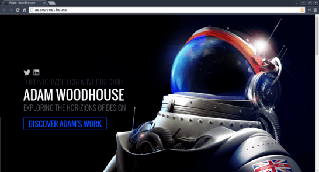
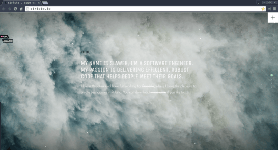

# Creating Our Own Personal Website

## Objectives

- ▢ Menggunakan berbagai ilmu pengembangan web yang sudah didapat
- ▢ Mengolah potensi kreatifitas yang ada dalam diri

## Directions

### Rancanglah website pribadi kamu

Tiba saatnya dalam hal favorit yang paling dinantikan oleh semua web developer: membuat website untuk pribadi! Beberapa orang melakukannya sebagai hobi yang seru, karena kita bisa mengekspresikan diri sekaligus bereksperimen dengan berbagai teknologi web. Sertakan minimal nama dan hal-hal favoritmu! Kreasikan dirimu.

- ▢ Buat ulang website kamu yang terdapat di `[USERNAME].github.io` dengan lebih baik.
- ▢ Link semua halaman hasil aktivitas yang ada jika belum.

### Bonus Inpirasi

Berikut berbagai contoh dan inspirasi personal website:

**[Adam Woodhouse](http://adamwood.house)**

**[Tameem Safi](https://safi.me.uk)**

**[Nathan Riley](http://nrly.co)**

**[Joe Dawson](http://joedawson.me)**

**[Sławomir Mazur](http://stricte.io)**

## References

- Temukan lebih banyak inspirasi di [One Page Love](https://onepagelove.com).
