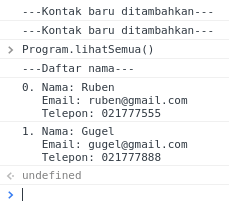

# Contact List

## Objectives

Membuat simulasi daftar kontak sederhana yang dapat menyimpan nama, email, telepon tiap orang.

1. Membuat objek sederhana yang dapat melakukan fungsi tertentu
2. Melihat properti dan nilai objek
3. Menambahkan/memasukkan sebuah nilai terhadap objek
4. Mencari nilai pada properti objek

## Directions

(1) Buatlah agar objek `DaftarKontak` berisi array kosong, yang nantinya akan memiliki beberapa objek lain.

```
DaftarKontak
// []
```

(2) Buatlah objek `Program` memiliki fungsi untuk mengolah `DaftarKontak` berikut walau belum ada isi logic-nya:
   - `tambahKontak(nama, email, telepon)`: menambahkan objek baru dengan properti di parameter
   - `lihatSemua()`: menampilkan semua objek yang ada
   - `cariKontak(nama)`: menampilkan objek sesuai yang punya nama di parameter

3. Mulailah membuat logic dalam fungsi `tambahKontak` dimana akan dibuat sebuah objek dengan properties sesuai parameter tersebut.

```
Program.tambahKontak("Ruben", "ruben@gmail.com", "021777555");
// ---Kontak baru ditambahkan---

console.log(DaftarKontak);
// menghasilkan seperti
// [
//  { email:"ruben@gmail.com", nama:"Ruben", telepon:"021777555" }
// ]
```

lalu jika kita tambah lagi...

```
Program.tambahKontak("Gugel", "gugel@gmail.com", "021777888");
// ---Kontak baru ditambahkan---

console.log(DaftarKontak);
// menghasilkan seperti
// [
//  { email:"ruben@gmail.com", nama:"Ruben", telepon:"021777555" },
//  { email:"gugel@gmail.com", nama:"Gugel", telepon:"021777888" }
// ]
```


(4) Menggunakan `console.log(DaftarKontak);` setiap ingin melihat semua daftar kontak yang ada agak terlihat jelek. Mari kita buat logic `lihatSemua()` agar dapat menampilkan semuanya dengan bagus.

```
Program.lihatSemua();
// ---Daftar nama---
// 0. Nama: Ruben
//    Email: ruben@gmail.com
//    Telepon: 021777555
// 1. Nama: Gugel
//    Email: gugel@gmail.com
//    Telepon: 021777888
```



(5) Bagaimana jika kita tau nama orang dan kita ingin tau nomor teleponnya? Buatlah agar `cariKontak(nama)` agar dapat mencari hal tersebut.

```
// ---Kontak Ruben ditambahkan---
// ---Kontak Gugel ditambahkan---

Program.cariKontak("Ruben");
// Nama: Ruben
// Email: ruben@gmail.com
// Telepon: 021777555
```


(6) (Opsional) `cariKontak` juga bisa dibuat parameter kedua untuk menampilkan data spesifik yang ditampilkan. Misalnya hanya mengembalikan/menampilkan `email` tanpa `nama` dan `telepon`. Begitupun seterusnya.
