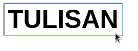
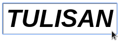

# Change Element Style with Event Listener

## Objectives

Optimalkan code kita menggunakan event listener daripada menggunakan event handler tradisional sebelumnya.

- ▢ Membuat event handler/listener.
- ▢ Memasang function pada event listener.
- ▢ Mendapatkan objek event dan mengolahnya.
- ▢ Menempatkan listener tergantung konteksnya.

## Directions

Context menu yang akan kita buat sesederhana untuk mengubah gaya font pada text yang kita klik. Ditampilkan seperti berikut.

Keadaan sebelum:

Setelah diklik kiri:

Setelah diklik kanan:

(0) Bukalah Dev Tools, JSBin, atau CodePen bahkan text/code editor untuk mengedit HTML dan JavaScript terlebih dahulu.

(1) Buatlah berbagai teks/tulisan yang kamu mau. Bisa pakai `h1`, `p`, `span`, ataupun `button`.

(2) Buatlah event listener untuk elemen tersebut yang akan beraksi jika ada klik kanan (`click`/`mousedown`) dan klik kiri (`contextmenu`)

(3) Di baris sebelum menambah event listener, buatlah fungsi untuk mengganti style dari tulisan, misalnya `makeBold()` dan `makeItalic()`.

(4) Cobalah untuk klik kanan dan kiri terhadap teks tersebut.
