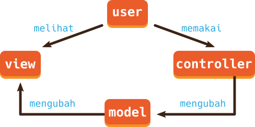

# Get to Know Application Design and Architecture

## Objectives

Dalam mebuat aplikasi yang makin besar dan baik, kita perlu memperhatikan struktur desain/rancangan yang kita gunakan. Hal ini akan berpengaruh terhadap kualitas code, maintainability dari aplikasi, keamanan, kecepatan/performa, kemudahan penggunaan, dan lain-lain.

## Directions

### Mengetahui Design Pattern

Pola desain (design pattern) adalah cara dan solusi yang dapat digunakan berulang kali untuk mengatasi berbagai masalah pada pembuatan software. Pola ini merupakan gabungan dari berbagai pemikiran yang ada sebelumnya dan masih baru, untuk mengeksplorasi kemampuan bahasa pemrograman dan platform. Design pattern yang paling populer adalah MVC pattern, yang perkembangannya bisa sesuai kebutuhan seperti MVP dan MVVC.

**MVC**

MVC (Model-View-Controller)
adalah design pattern secara arsitektur yang memisahkan code sesuai dengan kebutuhan atau fungsinya (seringkali disebut _separation of concerns_). Dengan ini, terjadi pemisahan atau isolasi terhadap:

- data aplikasi atau bisnis (Model)
- tampilan antarmuka pengguna (View)
- komponen logic dan input pengguna (Controller)

Masing-masing dari bagian ini mengandung HTML, CSS, dan JavaScript; namun secara tujuan berbeda tergantung dari klasifikasinya. Berikut ilustrasi diagram hubungan antara bagian tersebut.

### Mengetahui Application Architecture

Kita akan bahas ini lain kali. Namun sekarang cukup tahu terlebih dahulu saja, bahwa dalam membuat aplikasi, terdapat berbagai teknik percanganan atau arsitektur. Seperti...

- Modularization
- Web API
- Service Oriented Architecture (SOA)
- Real Time Protocol with Socket.io
- dan berbagai lainnya sesuai kebutuhan
